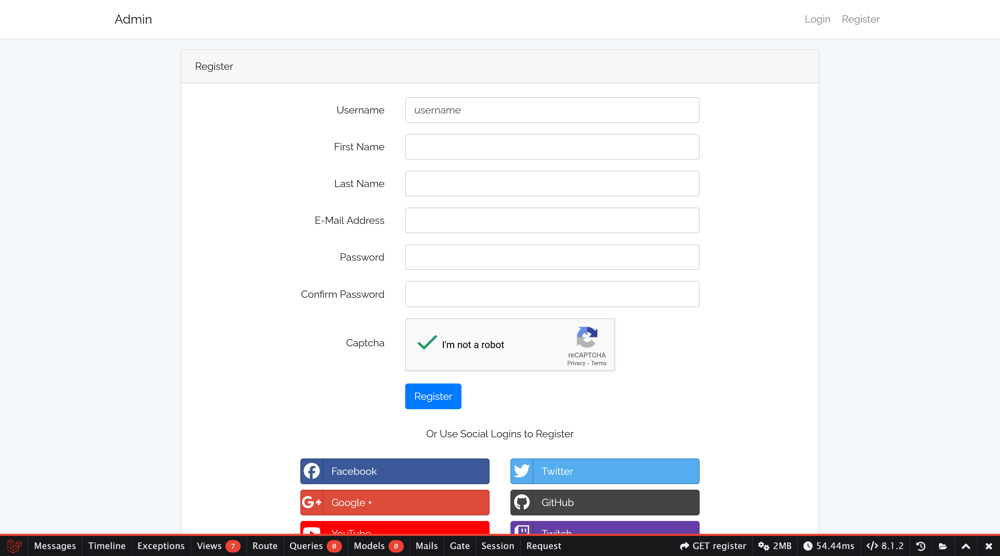
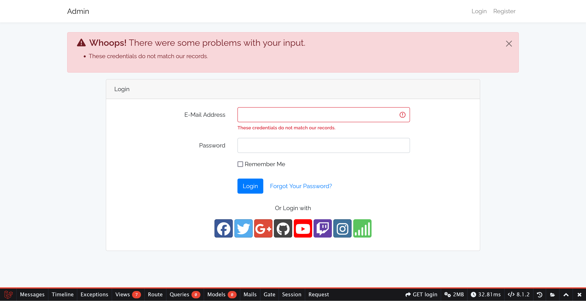
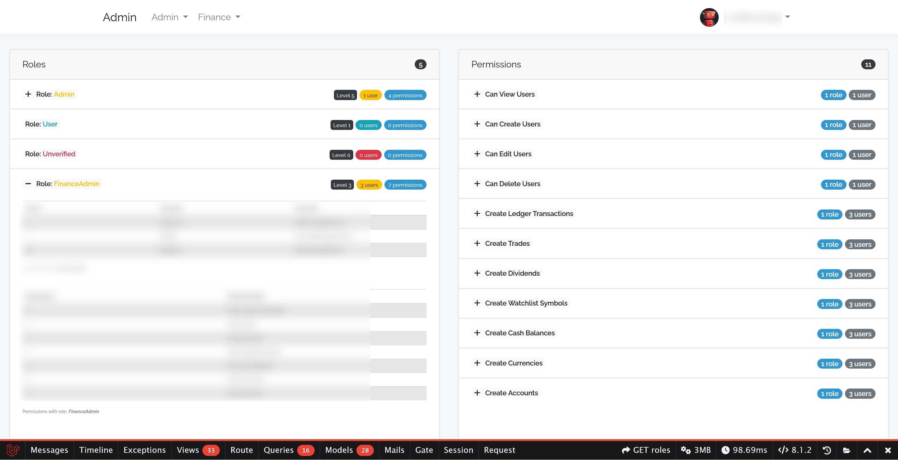
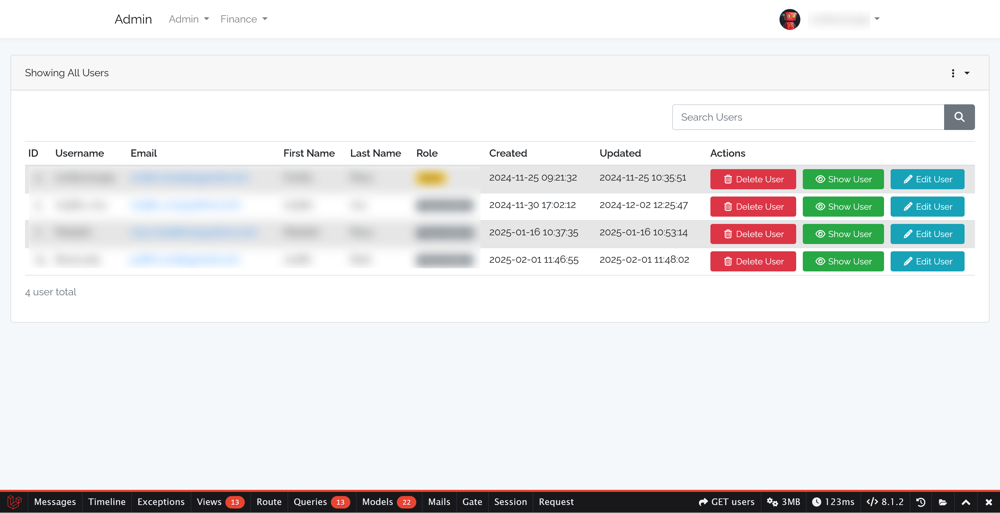
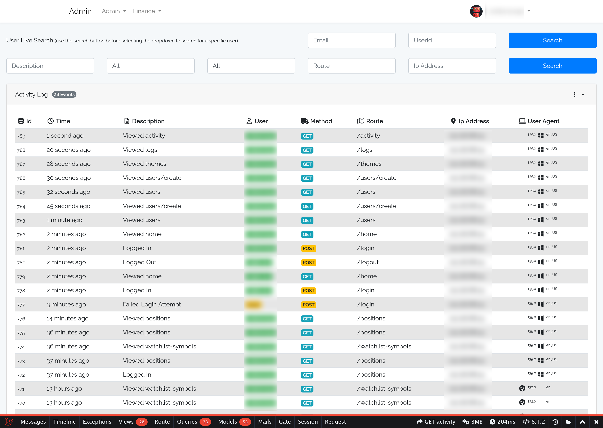

# Laravel Admin

Laravel application for managing accounts and their assets

- user registration with email confirmation, authentication and password recovery, profile management
- roles administration
- users administration
- themes
- log files
- activity log
- PHP information
- routing details
- blocker

## Images











More images in the [images folder](images).

## Original Source

Forked from [jeremykenedy/laravel-auth](https://github.com/jeremykenedy/laravel-auth) from Nov 17, 2024.

Updated (sync fork) on Dec 26, 2025; note that this project is upgraded to Bootstrap 5.3 while the original project is still on Boostrap 4.

Please check the original [README.md](README-laravel-auth.md).

## Installation instructions

```bash
sudo apt-get install php-intl php-dom php-mysql php-mbstring php-gd htop colordiff

mysql -uroot -p
    CREATE DATABASE [DB_DATABASE];
    CREATE USER '[DB_USERNAME]'@'localhost' IDENTIFIED WITH mysql_native_password BY '[DB_PASSWORD]';
    GRANT ALL PRIVILEGES ON [DB_DATABASE].* TO '[DB_USERNAME]'@'localhost';
    exit

mysql -u[DB_USERNAME] -p [DB_DATABASE] # use [DB_PASSWORD] set above


cp .env.example .env
vim .env # update the settings

mkdir -p storage/framework/cache/data/
mkdir -p storage/app/
sudo chown -R :www-data storage/
sudo chown -R :www-data storage/framework/cache/data/
sudo chown -R :www-data storage/app/
sudo chmod -R 775 storage/app/

cd storage/
mkdir -p framework/{sessions,views,cache}
chmod -R 775 framework
chown -R :www-data framework
cd ..
php artisan cache:clear

sudo chown :www-data bootstrap/cache

sudo apt-get install php8.1-bcmath

# Check below how to get the bitbucket oauth keys
composer update

# If you have a database dump, use that, otherwise setup the basic things
php artisan vendor:publish --tag=laravelroles
php artisan vendor:publish --tag=laravel2step
php artisan vendor:publish --tag=laravel-email-database-log-migration
# sudo chmod -R 755 ../laravel-admin
php artisan key:generate
php artisan migrate
composer dump-autoload
php artisan db:seed

yarn install
yarn run dev
yarn run prod
```

## Update to PHP 8.2

```bash
sudo apt update
sudo apt-get install software-properties-common
sudo add-apt-repository ppa:ondrej/apache2
sudo add-apt-repository ppa:ondrej/php
sudo apt update
sudo apt install php8.2
php --version
php8.2 --version
sudo apt-get install php8.2-cli libapache2-mod-php8.2 php8.2-mysql php8.2-curl php8.2-intl php8.2-mbstring php8.2-gd php8.2-simplexml php8.2-bcmath
sudo update-alternatives --set php /usr/bin/php8.2
php --version

sudo a2dismod php8.1
sudo a2enmod php8.2
systemctl restart apache2
```

## Populate sample blockers (if you didn't import a database dump already)

```bash
cd vendor/jeremykenedy/laravel-blocker/src/
mkdir -p database/
cd database/
ln -s ../Database/Seeders/ seeders
ln -s ../Database/Migrations/ migrations

php artisan vendor:publish --tag=laravelblocker-migrations

chmod 775 database/seeders/*
ls -la database/seeders/

#NOTE Execute the following the the vendor assets or the Database Seeds were not already run above
php artisan vendor:publish --tag=laravelblocker-seeds
php artisan db:seed
```

## Build the Back End and Front End Assets

```bash
composer update
composer dump-autoload
php artisan view:clear
php artisan optimize:clear

# php artisan test --filter test_users_can_authenticate_using_the_login_screen
# php artisan test --filter MyFinance2
php artisan test

yarn install
yarn run dev
yarn run prod
>storage/logs/laravel.log

# Clear cache
sudo chown :www-data -R storage/framework/cache/data
php artisan config:clear && php artisan cache:clear && sudo systemctl restart apache2
```

## Check README.md from ovidiuro/myfinance2 and follow the installation instructions

## Cleanup after full install

After you registered and ensured that everything works fine, clean up the default users.

```bash
mysql -u[DB_USERNAME] -p [DB_DATABASE] # use [DB_PASSWORD] set above
    select * from users;
    delete from users where id <> [YOUR_USER_ID];

    select * from role_user;
    delete from role_user;

    select * from roles;

    -- Make yourself an admin
    insert into role_user (role_id, user_id, created_at, updated_at) values (1, [YOUR_USER_ID], now(), now());
```

## Disable register by uncommenting the following line

```bash
vim routes/web.php
######################
Auth::routes([
    // 'register' => false, // Disable register by uncommenting this line
]);
######################
```

## Setup the private bitbucket repository

1. Login on bitbucket
1. Your profile >> All workspaces >> Manage >> OAuth consumers >> Add consumer
    - name: [SUBDOMAIN].[DOMAIN].[TLD]
    - check 'This is a private consumer'
    - check Repositories.Read
1. Copy the Key & Secret into auth.json

```bash
mkdir -p ~/.composer/; cp auth.json.example ~/.composer/auth.json
vim ~/.composer/auth.json
```

## How I solved some 'yarn run' failures

```bash
yarn run dev
######################
# Error 1: ERROR] "vite-plugin-pages-sitemap" resolved to an ESM file. ESM file cannot be loaded by `require`
## Added "type": "module" to package.json


# Error 2: failed to load config from vite.config.js
## Removed 'Plugin' from 'import {} from '"vite"' in vite.config.js


# Error 3: [Failed to load PostCSS config] Failed to load PostCSS config
## mv postcss.config.js backup_postcss.config.js
#######################

yarn run prod
######################
# Error 1: npm error Could not resolve dependency:
           npm error peer eslint@"^8.56.0" from @vue/eslint-config-typescript@13.0.0
## Change "@vue/eslint-config-typescript": "^13.0.0" TO "@vue/eslint-config-typescript": "^14.1.3" in package.json

# Error 2: npm error Could not resolve dependency:
           npm error peer eslint@"^7.32.0 || ^8.2.0" from eslint-config-airbnb-base@15.0.0
## Remove "eslint-config-airbnb-base": "^15.0.0" from package.json
## Remove "airbnb-base" from .eslintrc.js

# Error 3: npm error Could not resolve dependency:
           npm error peer stylelint@"^13.0.0 || ^14.0.0 || ^15.0.0" from stylelint-webpack-plugin@4.1.1
## Change "stylelint-webpack-plugin": "^4.1.0" TO "stylelint-webpack-plugin": "^5.0.1" in package.json

# Error 4: Invalid option '--ext' - perhaps you meant '-c'?
           You're using eslint.config.js, some command line flags are no longer available.
## Add ESLINT_USE_FLAT_CONFIG=false before 'eslint' for both 'lint' and 'prod' scripts in package.json

# Error 5: .eslintrc.js is treated as an ES module file as it is a .js file whose nearest parent package.json contains "type": "module" which declares all .js files in that package scope as ES modules.
## git mv .eslintrc.js .eslintrc.cjs
######################
```

## Other Utilities

```bash
# After migrating to Bootstrap 5, we need to do these changes to keep certain functionality
cd resources/views/vendor/
grep -rl data-target . | xargs sed -i 's/data-target/data-bs-target/g'
grep -rl data-toggle . | xargs sed -i 's/data-toggle/data-bs-toggle/g'
grep -rl data-dismiss . | xargs sed -i 's/data-dismiss/data-bs-dismiss/g'
grep -rl data-original-title . | xargs sed -i 's/data-original-title/data-bs-original-title/g'

# Check vendor overwrite path (Look for publishFiles and use error_log to see the path)
vim vendor/jeremykenedy/laravel-logger/src/LaravelLoggerServiceProvider.php
vim vendor/jeremykenedy/laravel-blocker/src/LaravelBlockerServiceProvider.php

```
